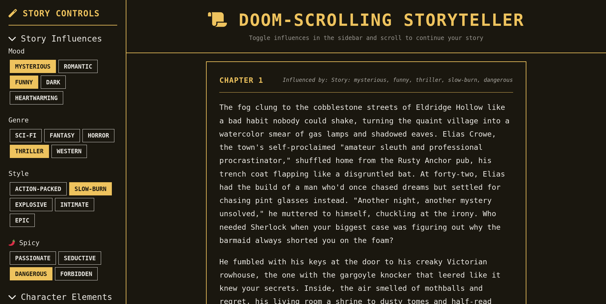

# 📜 Doom-scrolling Storyteller

An infinite scroll storytelling web application that generates personalized, AI-powered narratives. Users can influence story direction through toggleable badges while experiencing endless, engaging content in a retro terminal theme.



## ✨ Features

- **🔄 Infinite Scroll Storytelling**: Automatically generates new story segments as you scroll
- **🎛️ Interactive Story Influence**: Toggle badges to control mood, genre, style, and character elements
- **🏷️ Dynamic Badge Creation**: Add custom story influences through text input
- **📱 Responsive Design**: Works seamlessly on desktop and mobile devices
- **🤖 AI-Powered Generation**: Uses OpenRouter API for high-quality story creation
- **🖥️ Terminal Theme**: Retro computing aesthetic with Terminal.css
- **💾 Session Management**: Stories maintain continuity across segments
- **⚡ Performance Optimized**: Configurable story summarization and session optimization

## 🚀 Quick Start

### Prerequisites

- Python 3.8+
- [uv](https://docs.astral.sh/uv/) (recommended Python package manager)

### Installation

1. **Clone the repository**:
   ```bash
   git clone https://github.com/alx/doomscroll-stories.git
   cd doomscroll-stories
   ```

2. **Install dependencies using uv**:
   ```bash
   uv pip install -r requirements.txt
   ```

   > **Alternative**: If you don't have uv installed, you can use pip:
   > ```bash
   > pip install -r requirements.txt
   > ```

3. **Configure environment variables**:
   ```bash
   cp .env.example .env
   # Edit .env with your actual values (see Environment Variables section)
   ```

4. **Run the application**:
   ```bash
   uv run python doom_scroll_storyteller.py
   ```

   > **Alternative**: `python doom_scroll_storyteller.py`

5. **Open in browser**:
   Visit `http://127.0.0.1:5000` to start doom-scrolling!

## ⚙️ Environment Variables

Create a `.env` file in the project root with the following variables:

### Required Variables

```bash
# OpenRouter API Key (required)
OPENROUTER_API_KEY=your-openrouter-api-key-here

# Flask Secret Key (change for production)
SECRET_KEY=your-secure-secret-key-change-this
```

### Optional Variables

```bash
# OpenRouter Model (default: openai/gpt-4o-mini)
OPENROUTER_MODEL=openai/gpt-4o-mini

# Story optimization settings
SUMMARY_WINDOW_SIZE=5      # Summarize after N segments
RECENT_SEGMENTS_COUNT=2    # Keep N recent segments with summary

# Session optimization
OPTIMIZE_SESSIONS=true     # Enable session cleanup
MAX_SESSION_SIZE_KB=500    # Maximum session data size
```

### Getting an OpenRouter API Key

1. Visit [OpenRouter.ai](https://openrouter.ai/)
2. Sign up for an account
3. Navigate to the API Keys section
4. Create a new API key
5. Copy the key to your `.env` file

## 🎮 How to Use

1. **Select Story Influences**: Toggle badges in the sidebar to influence your story
   - **Mood**: mysterious, romantic, funny, dark, heartwarming
   - **Genre**: sci-fi, fantasy, horror, thriller, western
   - **Style**: action-packed, slow-burn, explosive, intimate, epic
   - **Spicy**: passionate, seductive, dangerous, forbidden

2. **Add Character Elements**: Choose character types, traits, and relationships

3. **Create Custom Influences**: Use the text input to add your own badge influences

4. **Start Scrolling**: Click "Generate Story" to begin your personalized narrative

5. **Keep Scrolling**: New story segments generate automatically as you reach the bottom

6. **Change Direction**: Toggle different badges to influence upcoming segments

7. **Start Fresh**: Click "New Story" to begin a completely new narrative

## 🏗️ Architecture

### Core Components

**Backend (`doom_scroll_storyteller.py`)**:
- `StoryGenerator` class: Handles OpenRouter API integration
- Flask routes for API endpoints (`/api/start_story`, `/api/continue_story`, etc.)
- Session-based story state management with optimization
- Environment variable configuration via python-dotenv
- Comprehensive logging with `logging_config.py`

**Frontend (`templates/index.html` + `static/style.css`)**:
- Terminal.css + Bootstrap 5 for retro terminal design
- Vanilla JavaScript for infinite scroll and AJAX interactions
- Collapsible sidebar with toggleable story influence badges
- Dynamic content loading with smooth animations
- Mobile-responsive design with touch-friendly interfaces

### Data Flow

1. User selects story influence badges and character elements in sidebar
2. Frontend sends AJAX request to `/api/start_story` with active influences
3. `StoryGenerator` creates OpenRouter API call with influences as prompt context
4. Generated story segment stored in Flask session and returned to frontend
5. As user scrolls, `/api/continue_story` generates next segments with full story context
6. Story summarization automatically manages session size for long stories

### Session Management

- **story_segments**: List of generated story parts with automatic summarization
- **badges**: Available influence badges (default + user-added)
- **session_optimization**: Configurable cleanup and size management
- Stories maintain narrative continuity through intelligent context management

## 🛠️ Development

### Project Structure

```
doomscroll_stories/
├── doom_scroll_storyteller.py    # Main Flask application
├── logging_config.py             # Logging configuration
├── requirements.txt              # Python dependencies
├── templates/
│   └── index.html               # Main web interface
├── static/
│   ├── style.css               # Custom styles
│   └── terminal.css            # Terminal theme styles
├── docs/
│   └── screenshot.png          # Application screenshot
├── .env                        # Environment variables (create from .env.example)
└── CLAUDE.md                   # Development instructions
```

### Running with uv

```bash
# Install dependencies
uv pip install -r requirements.txt

# Run the application
uv run python doom_scroll_storyteller.py

# For development with auto-reload
uv run python doom_scroll_storyteller.py --debug
```

### API Endpoints

- `GET /` - Main application interface
- `POST /api/start_story` - Generate initial story segment
- `POST /api/continue_story` - Generate next story segment
- `POST /api/add_badge` - Add custom story influence badge
- `GET /api/get_badges` - Retrieve available badges
- `GET /api/get_characters` - Retrieve character elements
- `POST /api/reset_story` - Reset story session

### Customization

- **Story Length**: Modify segment length in OpenRouter prompts (currently 200-300 words)
- **Default Badges**: Edit initial badge categories in Flask application
- **Styling**: Customize appearance in `static/style.css`
- **Models**: Change OpenRouter model via `OPENROUTER_MODEL` environment variable
- **Session Behavior**: Adjust optimization settings for performance vs. memory usage

## 🎨 Technical Features

- **Infinite Scroll**: Intersection Observer API for smooth scroll detection
- **Terminal Theme**: Custom CSS with Terminal.css integration for authentic retro look
- **Session Optimization**: Automatic story summarization prevents memory bloat
- **Error Handling**: Comprehensive error handling with user-friendly messages
- **Mobile Support**: Responsive design with collapsible sidebar
- **Performance**: Configurable API timeouts and request optimization
- **Accessibility**: Proper ARIA labels and keyboard navigation support

## 📄 License

This project is open source and available under the [MIT License](LICENSE).

## 🤝 Contributing

Contributions are welcome! Please feel free to submit a Pull Request. For major changes, please open an issue first to discuss what you would like to change.

## 🐛 Issues

If you encounter any problems, please [open an issue](https://github.com/alx/doomscroll-stories/issues) with:
- Your operating system
- Python version
- Error messages (if any)
- Steps to reproduce the issue

---

**Enjoy your personalized doom-scrolling storytelling experience!** 🎭✨
